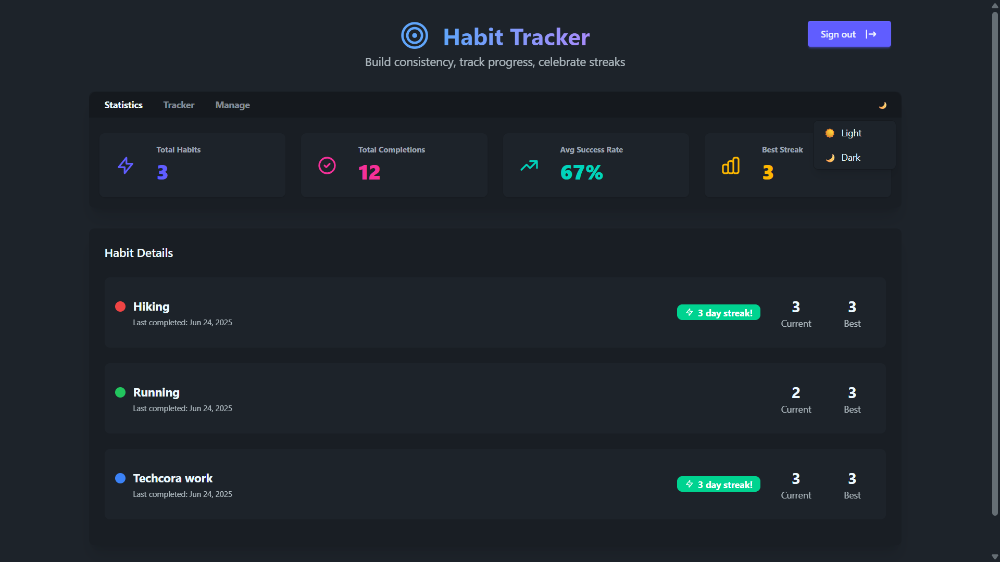
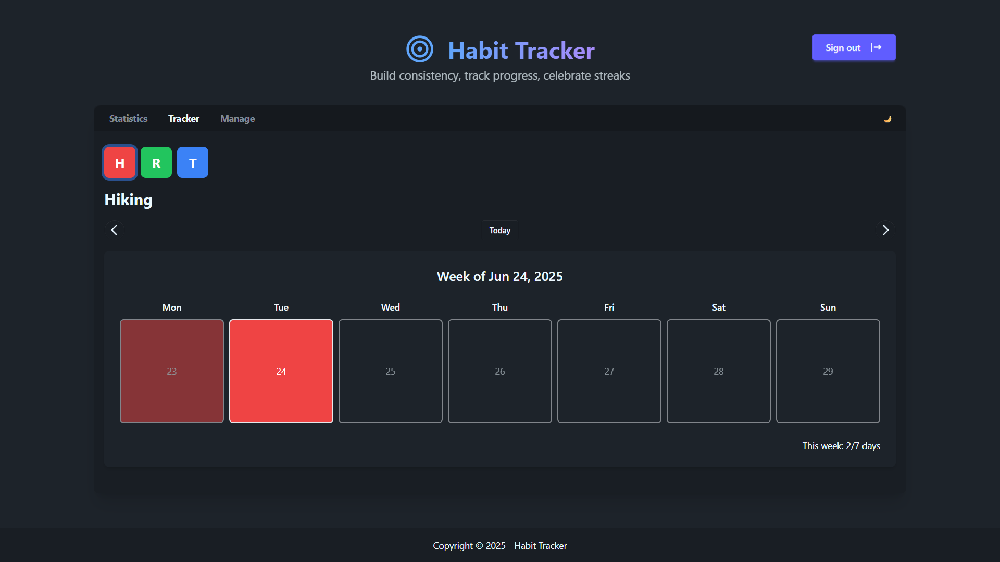
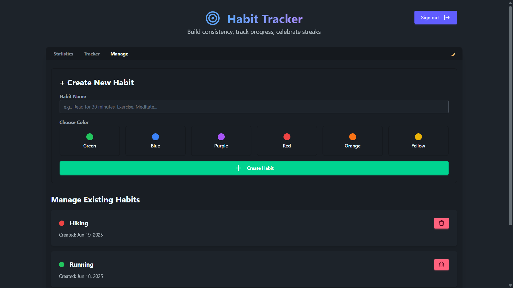

# Habit Tracker

A modern, user-friendly habit tracking application built with Angular and Firebase. Track your daily habits, monitor your progress, and build better routines.

## 📱 Screenshots

### Dashboard View

*Dashboard showing habit statistics and tracking*

### Tracker View

*Track your daily habits with a weekly calendar view*

The Tracker view provides a clean interface to monitor your habit completion:
- Weekly calendar layout showing completion status
- Visual indicators for completed days
- Weekly progress summary (e.g., "2/7 days")
- Easy navigation between weeks
- Quick action buttons for each day

### Manage Habits View

*Create and manage your habits with ease*

The Manage Habits view allows you to:
- **Create New Habits**
  - Set custom habit names
  - Choose from a variety of colors for visual distinction
  - Quick creation with minimal effort

- **Manage Existing Habits**
  - View all your habits in one place
  - See when each habit was created
  - Easily delete habits you no longer want to track
  - Visual color coding for quick identification

## ✨ Features

- 📊 Track daily habits and monitor your progress
- 🔐 Secure user authentication with Firebase
- 📱 Responsive design that works on all devices
- 📅 Calendar view for habit tracking
- 📈 Progress visualization and statistics
- 🔔 Reminder notifications

## Project Structure

```
src/
├── app/
│   ├── components/     # Shared components
│   ├── pages/          # Feature pages
│   ├── services/       # Application services
│   ├── guards/         # Route guards
│   ├── models/         # TypeScript interfaces/models
│   └── app.module.ts   # Root module
├── assets/             # Static assets
└── environments/       # Environment configurations
```

## License

This project is licensed under the MIT License - see the [LICENSE](LICENSE) file for details.
